# ITI Docker Labs - Image Examples

This repository contains basic docker comands & screenshots of Docker commands and examples used in ITI Docker labs.

---
# Docker & Docker Compose Commands Cheat Sheet

## Docker Containers

| Command | Usage |
|------|------|
| `docker run nginx` | Run a container from the nginx image |
| `docker run -d nginx` | Run container in background |
| `docker run -d -p 8080:80 nginx` | Run container with port mapping |
| `docker run -d --name my-nginx nginx` | Run container with a specific name |
| `docker ps` | Show running containers |
| `docker ps -a` | Show all containers (running + stopped) |
| `docker stop <container_id>` | Stop a container |
| `docker start <container_id>` | Start a stopped container |
| `docker restart <container_id>` | Restart a container |
| `docker rm <container_id>` | Remove a container |
| `docker rm -f <container_id>` | Force remove container |
| `docker stop $(docker ps -q)` | Stop all running containers |
| `docker rm -f $(docker ps -aq)` | Remove all containers |

---

## Docker Images

| Command | Usage |
|------|------|
| `docker images` | List all images |
| `docker pull nginx` | Download image from Docker Hub |
| `docker build -t myapp .` | Build image from Dockerfile |
| `docker build -f Dockerfile.dev -t myapp .` | Build image with custom Dockerfile |
| `docker rmi <image_id>` | Remove an image |
| `docker rmi $(docker images -q)` | Remove all images |

---

## Logs & Debugging

| Command | Usage |
|------|------|
| `docker logs <container_id>` | View container logs |
| `docker logs -f <container_id>` | Follow container logs in real time |
| `docker exec -it <container_id> bash` | Access container shell |
| `docker inspect <container_id>` | Show container detailed info |
| `docker stats` | Show container resource usage |

---

## Docker Volumes

| Command | Usage |
|------|------|
| `docker volume ls` | List volumes |
| `docker volume create myvolume` | Create volume |
| `docker volume rm myvolume` | Remove volume |
| `docker volume prune` | Remove unused volumes |

---

## Docker Networks

| Command | Usage |
|------|------|
| `docker network ls` | List networks |
| `docker network create mynetwork` | Create network |
| `docker network rm mynetwork` | Remove network |

---

## Docker Compose

| Command | Usage |
|------|------|
| `docker compose up` | Start services |
| `docker compose up -d` | Start services in background |
| `docker compose up --build` | Build images and start services |
| `docker compose down` | Stop and remove containers |
| `docker compose stop` | Stop services |
| `docker compose ps` | Show running compose services |
| `docker compose logs` | Show logs for services |
| `docker compose logs -f` | Follow logs |
| `docker compose exec <service> bash` | Run command inside service container |
| `docker compose -f docker-compose2.yml up` | Use custom compose file |

---

## Cleanup Commands

| Command | Usage |
|------|------|
| `docker system prune` | Remove unused containers, networks, images |
| `docker system prune -a` | Remove all unused images |
| `docker system prune -a --volumes` | Remove everything including volumes |

---

## File Copy

| Command | Usage |
|------|------|
| `docker cp <container_id>:/path/file ./file` | Copy file from container |
| `docker cp ./file <container_id>:/path/file` | Copy file to container |

---

## Common Workflow

| Step | Command |
|------|------|
| Build image | `docker build -t myapp .` |
| Run container | `docker run -d -p 5000:5000 myapp` |
| Check containers | `docker ps` |
| Check logs | `docker logs -f <container_id>` |
---

## Hello World
**Run the `hello-world` Docker image for the first time:**  
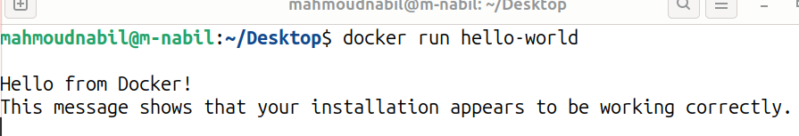

**Remove the `hello-world` Docker image:**  
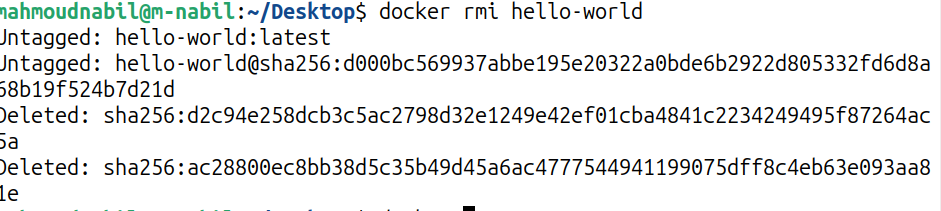

---

## Ubuntu Containers
**Run an Ubuntu container in interactive mode (`-it`):**  
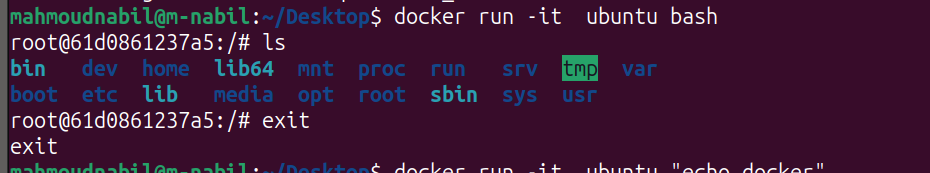

**Execute commands inside Ubuntu container interactively:**  
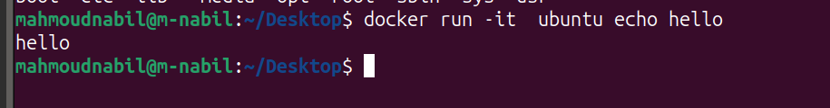

**Create a file inside Ubuntu container using `touch`:**  
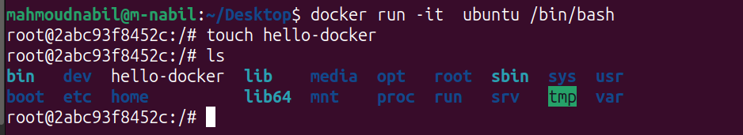

---

## Containers Management
**List all running Docker containers:**  
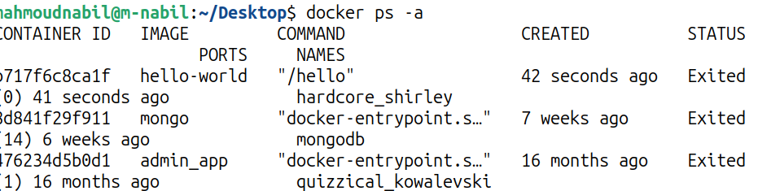

**Remove a specific container:**  
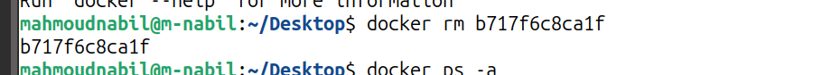

**Remove all containers at once:**  
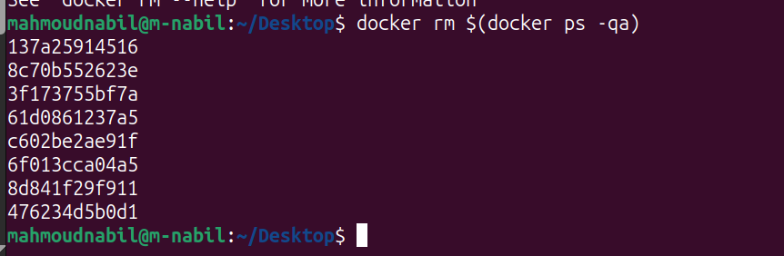

**Start a previously stopped container:**  
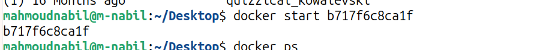

---

## Nginx Web Server
**Run Nginx container and change the `index.html` page:**  
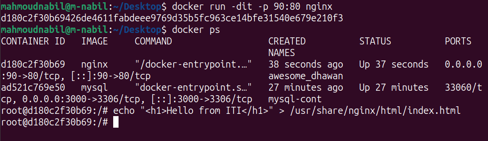

**Access Nginx page from browser:**  
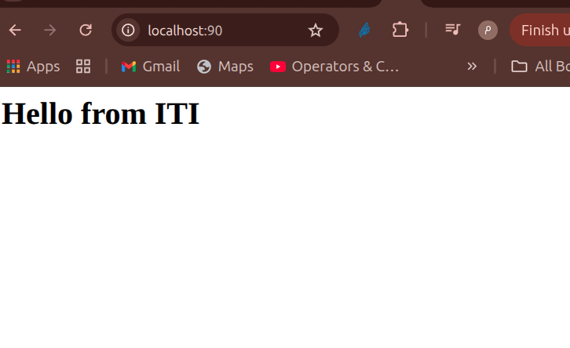

---

## MySQL
**Run a MySQL container:**  
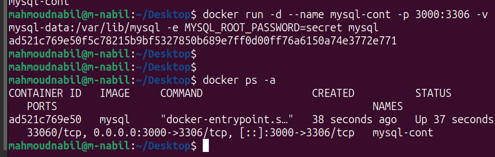

---

## Dockerfile
**Example of a Dockerfile used in labs:**  
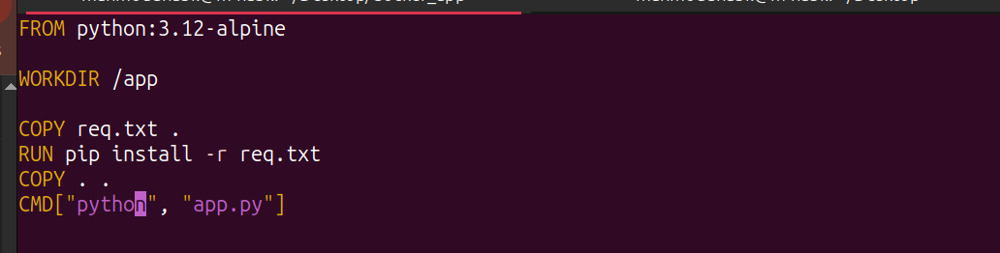

---

## Flask App
**Run a Flask app container:**  
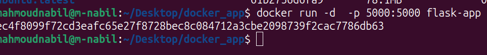

**Access the Flask app from the browser via mapped port:**  
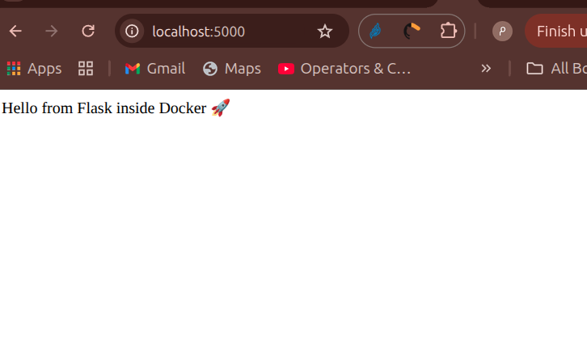

---
## Volumes
**create named volumes:**  
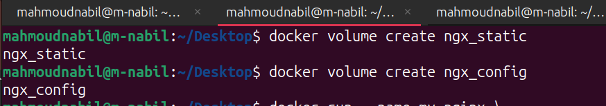
**create bind volumes:**  
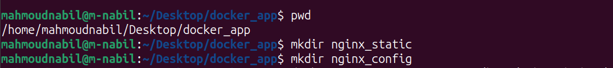

**attach 2 named volumes to container, then change index.html inside container:**
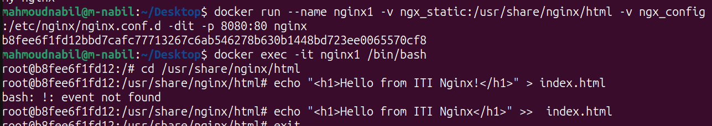

**attach to bind volumes to container, then change index.html inside container:**  
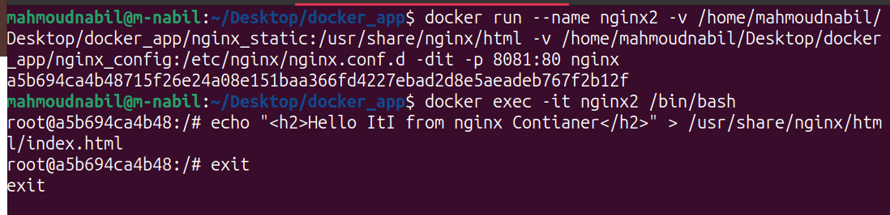


**remove old container, then attach named volumes to new container:**  
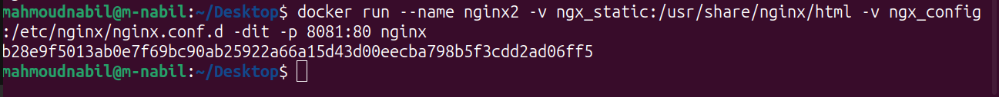

**remove old container, then attach bind volumes to new container:**  
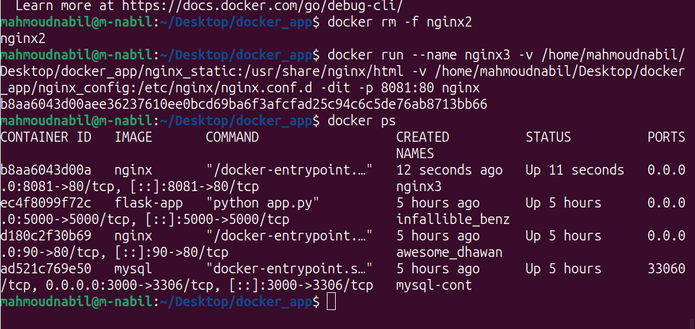

**access new contaienr with browser:**  
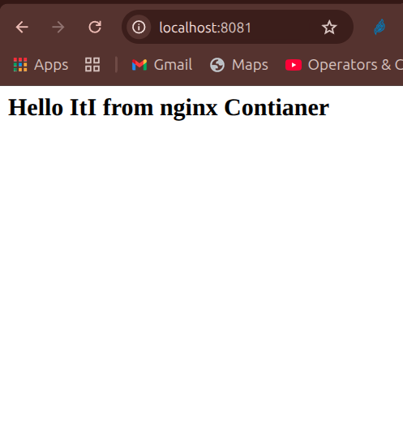

---
## Network

**Create 2 networks:**  
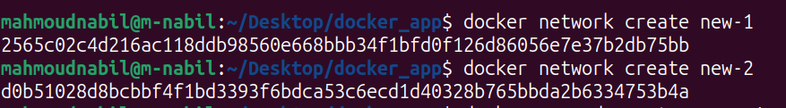

**Run nginx  container in network1:**  
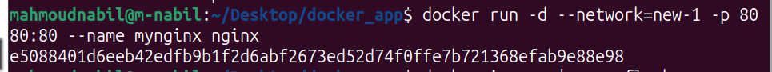

**Run a flask container in network1:**  
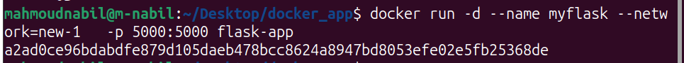

**execute nginx contianer with ```curl flask_container:port```:**  
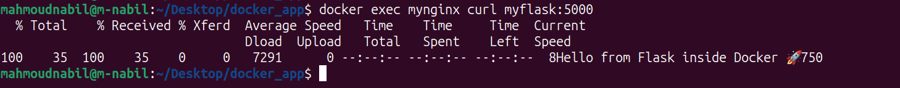

---

## Docker-compose

**docker compose (nginx, mysql) containers:**  
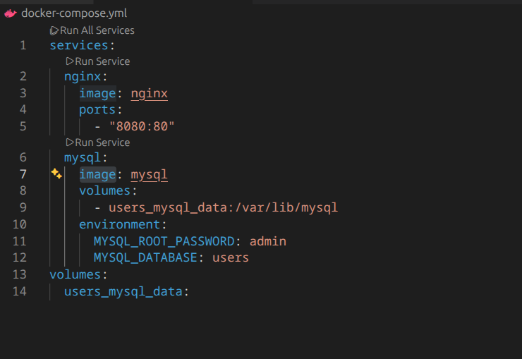

**docker compse (python, redis) containers :**  
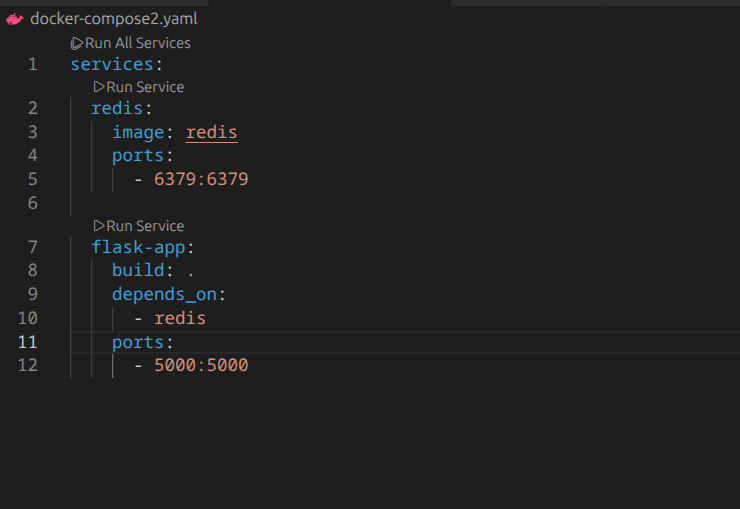

**dockerfile for python app:**  
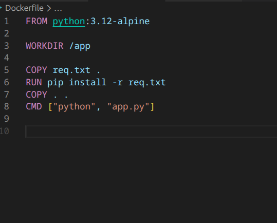

**python flask server(code) increase count each reload:**  
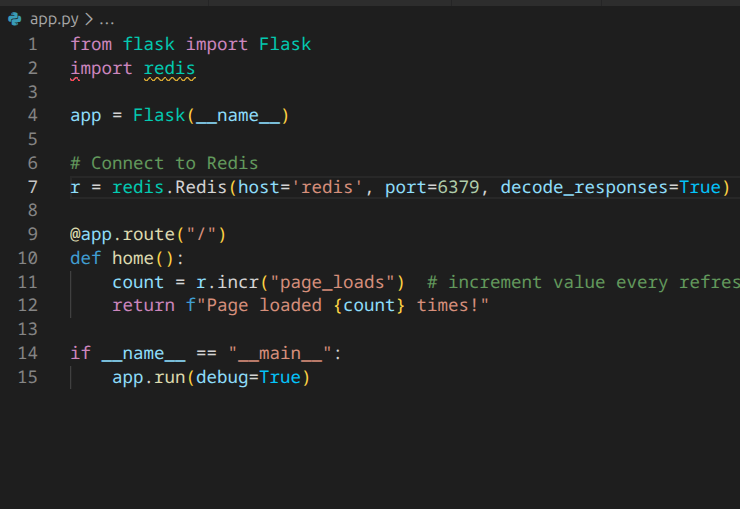

**python flask server(code):**  
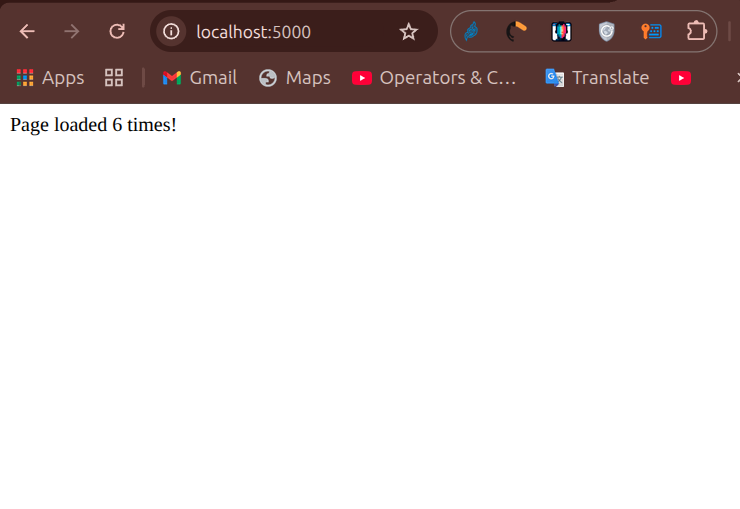


--- 

**Note:** All images are located in the `imgs/` folder. Open this `Readme.md` in GitHub, VS Code, or any markdown viewer to see the screenshots directly.